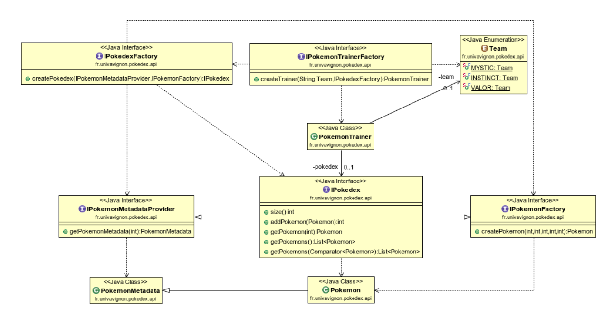
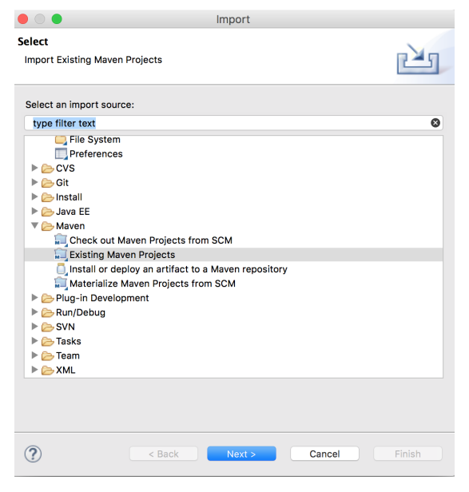

# TP1 : Fork them all !  

## Épisode 1 - Récupération de l'API

La partie spécification ainsi que l’écriture de l’architecture applicative n’est pas à faire dans  le cadre de ce TP. Elle est donnée et doit être récupérée sur [GitHub](https://github.com), si vous n'avez pas de compte GitHub, c'est le moment d'en créer un.  
Une fois connecté sur GitHub, rendez-vous à [cette adresse](https://github.com/Youkoulanda/ceri-m1-techniques-de-test) et cliquez sur le bouton "Fork" en haut à droite.

Le fork du projet fait une copie intégrale du repository sur votre compte.  
C’est ce projet "forké" que vous utiliserez comme base de travail.  
Vous pouvez maintenant récupérer le projet sur votre machine, pour cela, ouvrez un terminal et tapez la commande suivante en remplaçant `<YOUR_USERNAME>` par votre nom d'utilisateur sur GitHub:
```
git clone https://github.com/<YOUR_USERNAME>/ceri-m1-techniques-de-test.git
```
Le projet ne contient qu’un package Java `fr.univavignon.pokedex.api`, sous le répertoire `src/main`.  
Ce package expose l’API de notre application qui est décrite par le diagramme suivant :

<p align="center">
    
</p>

## Épisode 2 - Création du projet Maven

Comme vu en cours, la création d’un projet d’un projet Maven consiste uniquement à écrire  un fichier nommé `pom.xml` et d’y décrire les cycles de vie de notre application.  
Dans le cadre de  projet il nous faut définir :

- Les méta informations (nom, version , etc …)
- Les cycles de vie, à minima pour le build et les tests
- La liste des dépendances, incluant les librairies suivante : JUnit, Mockito

Une fois le fichier pom.xml écrit, vous pouvez importer le projet dans Eclipse, à l’aide du  menu `File > Import` :

<p align="center">
    
</p>

Ensuite sélectionnez le dossier racine de votre projet et finalisez l’import.

## Épisode 3 - Synchronisation avec Git

Nous avons maintenant un projet opérationnel pour travailler, il faut maintenant `commit`et `push` les changements sur GitHub. Deux options :

- Ligne de commande.
- Directement depuis Eclipse avec un plugin tel que eGit.

Pour la ligne de commande vous pouvez vous servir de la documentation fournie en introduction.  
Pour Eclipse, il suffit de faire un clic droit sur le projet dans la vue `PackageExplorer`, puis `Team >  Commit`.

<p align="center" style="color: #ffcb05; font-size: 2rem;">
Félicitation tu as gagné le badge suivant :
</p>
<p align="center">
    
</p>
<p align="center" style="color: #ffcb05; font-size: 2rem;">
Magicommit !
</p>
