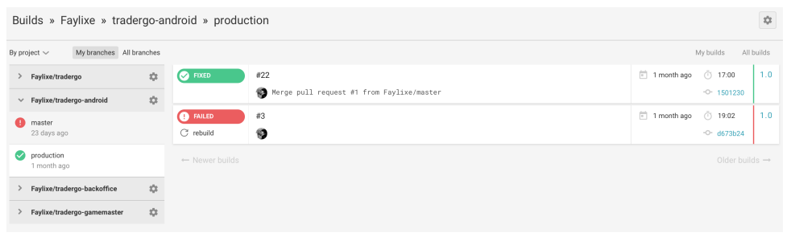

# TP2 : (Dés)intégration continue

## Épisode 1 - CircleCI

Nous avons un projet compatible avec Maven, nous allons maintenant mettre en place une intégration continue comme vu en cours. Pour cela nous allons utiliser la plateforme CircleCI.  
Commencez par vous rendre à [cette adresse](https://circleci.com), et connectez-vous en utilisant votre compte GitHub :

    

Le tableau de bord résume l’ensemble des builds effectués pour vos projets GitHub connecté, comme le montre la capture d'écran suivante :

    

## Épisode 2 - circle.yml

CircleCI s’enregistre comme listener des événements de votre repository. Ainsi lorsque qu’on push un commit, CircleCI déclenche une intégration continue exécutée dans un conteneur.  
La première étape de cette intégration continue est de chercher un fichier nommé `circle.yml` à  la racine de votre repository, si ce fichier n’est pas trouvé l’intégration continue échouera.  
En vous aidant de la documentation en ligne, vous devez écrire un fichier `circle.yml` avec les contraintes suivantes :

- Branche master uniquement.
- Environnement Java 8 ou supérieur.
- Execution des tests unitaires avec Maven.

Une fois écrit, "commitez” et "pushez" votre fichier `circle.yml` sur votre repository et assurez vous de la bonne exécution de l'intégration continue sur le dashboard de CircleCI.

Félicitation tu as gagné le badge suivant :

    

Désintégrateur !

