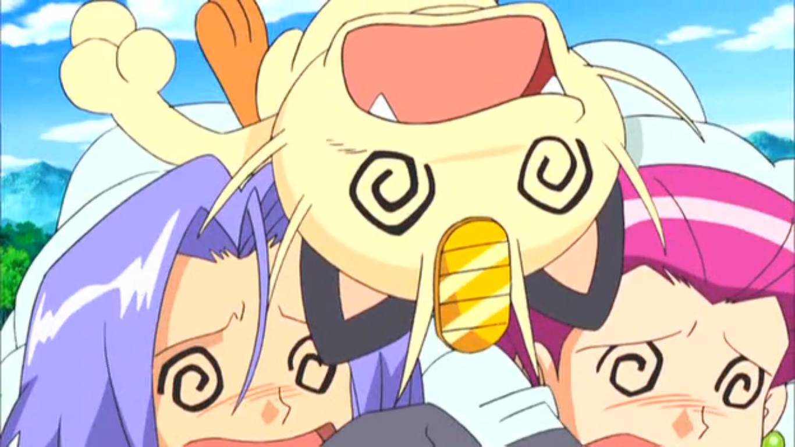

# TP6 : Ils sont de retour pour vous jouer un mauvais tour

## Épisode 1 - Giovanni's touch

Pour vous "aider", une autre équipe de développement, la Team Rocket, vous a fourni une implémentation de `IPokemonFactory` qui se veut "meilleure que la votre", vous pourrez la trouver dans le dossier `Rendu-TP1-Programmation-Java-Groupe-Rocket-Jessica-James-Miaouss`.  
Intégrez cette implémentation dans votre projet et passez la au crible grâce à votre suite de tests et au travers d'une revue de code,rédigez un succint rapport qui présente vos conclusions.  
Attention, la Team Rocket est sournoise, certains défauts de leur implémentation ne sont peut-être pas couverts par les tests que vous avez déjà mis en place, n'hésitez pas à relever ces défauts aussi, et, si vous y parvenez, à mettre en place des tests pour les détecter automatiquement.

Félicitation tu as gagné le badge suivant :

    

Champion d'arène !

